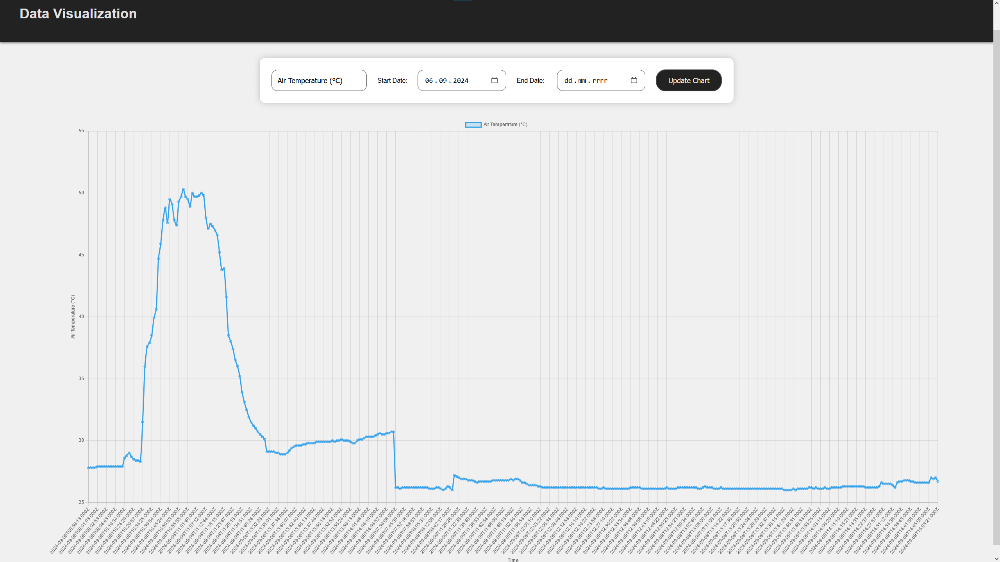

# Webapp
My first web application. Part of an internship project on LoRa-based communication, created at RED Electronics. This part manages the reception of data and visualises it. It also allows to send control signals to the sensor unit.
## Technologies

Frontend: HTML, CSS, JavaScript

Backend: Node.js, Python (LoRa data input/output)

Database: PostgreSQL

## Appearance

